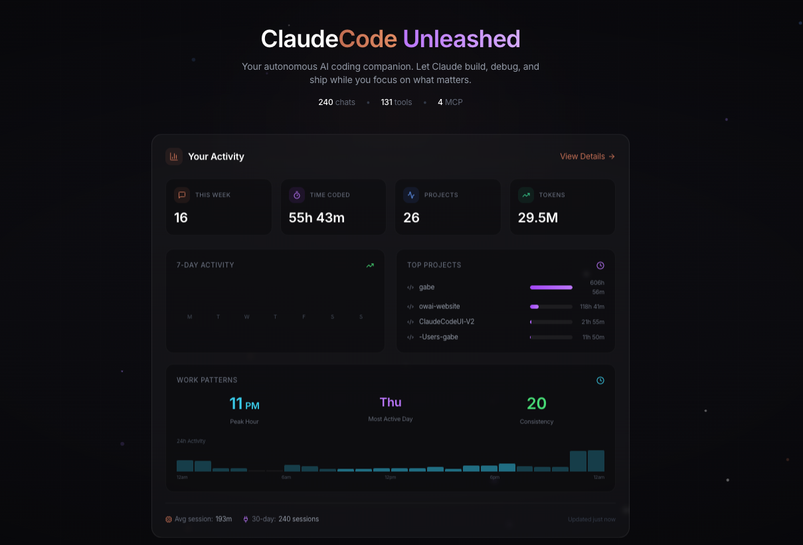
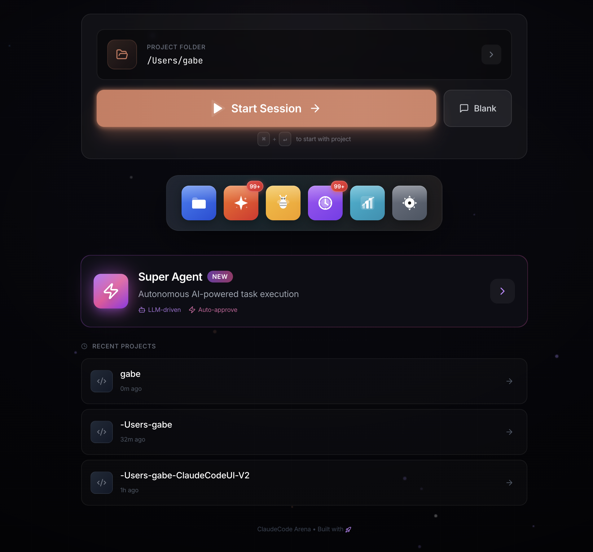

# Claude Code Unleashed

**Code with Superpowers.**

The premium native desktop experience for [Claude Code](https://github.com/anthropics/claude-code) and [OpenAI Codex](https://github.com/openai/codex). Multi-agent swarms, analytics, per-tab CLI provider selection, and a beautiful zero-config environment that lets you build faster—whether you're a developer or just getting started.

[](https://github.com/OneWave-AI/ClaudeCodeUnleashed/releases)
[](https://onewave-ai.com)

## Screenshots

<p align="center">
  
  <br/>
  <em>Dashboard with analytics, activity tracking, and project insights</em>
</p>

<p align="center">
  
  <br/>
  <em>Home screen with project selection, Super Agent, and recent projects</em>
</p>

## Who Is This For?

### For Developers
Stop context switching. Unleashed gives you a native terminal environment that integrates directly with your existing toolchain.
- **Full Git Workflow**: Visual commit graphs, one-click PRs, and conflict resolution without leaving the app
- **Multi-Agent Swarms**: Spin up specialized agents for testing, security, and refactoring to run in parallel
- **Zero Config**: Auto-detects your dev server, linter, and package manager instantly

### For Everyone
You don't need to be a coding expert to build amazing things. Unleashed translates your ideas into working software.
- **Natural Language**: Just describe what you want—"Make a landing page for my bakery"—and watch it happen
- **Visual Feedback**: See your changes live as they happen in the built-in browser preview
- **Automate Anything**: From organizing spreadsheets to scraping websites, let AI do the boring work

## What's New in V2

- **Complete Rebuild**: Modern React + TypeScript architecture
- **Faster Performance**: Vite bundler with hot module replacement
- **Better State Management**: Zustand stores for predictable state
- **Type Safety**: Full TypeScript coverage
- **Tailwind CSS**: Utility-first styling

## Features

### Analytics Dashboard
Track your active coding time and productivity:
- **Active Time Tracking**: Measures actual coding time by excluding idle gaps (breaks, meetings, overnight)&mdash;no more inflated hours
- **Usage Statistics**: Sessions, active time, tokens used at a glance
- **7-Day/30-Day Views**: See trends over different time periods
- **Project Time Tracking**: Accurate per-project time for billing&mdash;only counts active work
- **Activity Charts**: Visual breakdown of your daily coding activity
- **Top Projects**: See which projects got the most attention
- **Skeleton Loaders**: Smooth loading experience with beautiful placeholder animations

### Agent Hive (Swarm)
Launch multiple AI agents to audit and fix your codebase:
- **Audit Mode**: Spawn 3+ specialized agents to review code quality, security, and performance
- **Action Mode**: Deploy agents to fix issues, refactor, and add tests
- **Real-Time Progress**: Visual tracking of agent status and completion
- **One-Click Launch**: Glowing "Hive" button for instant agent deployment
- **Smart Selection**: Claude automatically picks the most relevant agents for your situation

### Orchestrator
Multi-terminal agent coordination for parallel and split-task workflows:
- **Auto-Terminal Creation**: Click Launch and terminals are created automatically -- no manual grid setup
- **Split Mode**: Decompose one master task into sub-tasks across multiple terminals
- **Parallel Mode**: Run independent tasks simultaneously across terminals
- **Cross-Terminal Awareness**: Each terminal's LLM knows what the others are doing to avoid duplicate work
- **Smart Completion Detection**: Automatically detects when Claude finishes a task and stops the orchestrator when all terminals complete
- **Error Recovery**: Exponential backoff retry (up to 8 attempts) instead of silently dying on LLM failures
- **Smart Output Summarization**: Extracts head, key events, and tail from terminal output instead of naive truncation
- **Coordinator Log**: Real-time visibility into orchestrator decisions and terminal status

### Super Agent
Autonomous AI-powered task execution that lets Claude work independently:
- **LLM-Driven**: An outer LLM monitors Claude's terminal output and decides what to do next
- **Auto-Approve**: Automatically approves tool calls and continues until the task is done
- **Fast-Path Routing**: Known prompts (y/n, trust, permission) are answered instantly without an LLM call (<500ms vs 6-7s)
- **Smart Status Detection**: Skips LLM calls entirely when Claude is actively working (spinner, tools running)
- **Bulk Terminal Write**: Text appears instantly in the terminal instead of character-by-character typing
- **Rolling Output Buffer**: Maintains full conversation context with sent-message markers instead of clearing output
- **Adaptive Idle Timeout**: Shorter timeouts (1.5s) for waiting prompts, longer (8s) when Claude is working
- **Structured JSON Output**: LLM responds with `{"action": "wait|send|done", "text": "..."}` for reliable parsing
- **Terminal Buffer Snapshot**: Takeover mode reads current terminal state immediately via IPC ring buffer
- **Time Limits**: Set execution time limits (5-60 minutes)
- **Activity Log**: Real-time visibility into the agent's decisions (fast-path vs LLM)
- **Side Panel**: Collapsible status bar shows progress without blocking the terminal

### Plan Panel
Track Claude's multi-step tasks in real-time:
- **Live Task Tracking**: See Claude's current plan and progress
- **Status Indicators**: Visual markers for pending, in-progress, and completed tasks
- **Progress Bar**: Overall completion percentage at a glance
- **Slide-In Animation**: Smooth panel appearance when toggled

### Multi-Provider Terminal Tabs
Run Claude Code and OpenAI Codex side by side in the same window:
- **Per-Tab Provider**: Each terminal tab independently chooses its CLI (Claude Code or Codex)
- **Adaptive Status Bar**: Model menu, plan toggle, and status detection auto-switch based on the active tab
- **Claude Code Models**: Opus 4.6, Sonnet 4.6, Haiku 4.5
- **Codex Models**: GPT-5.3 Codex, GPT-5.3 Spark, GPT-5.2 Codex, GPT-5.1 Max
- **Default Provider Setting**: Choose which CLI new tabs open with (configurable in Settings)
- **Install Detection**: HomeScreen shows install status and one-click install for both CLIs

### Split Terminal Panels
Work with multiple terminals simultaneously:
- **Dual Panels**: Run two terminals side-by-side
- **Tab Support**: Multiple tabs per panel with per-tab provider selection
- **Browser Tabs**: Built-in browser with mobile/desktop viewport toggle
- **Drag & Drop**: Reorganize tabs between panels (provider follows the tab)
- **Grid Layout**: 3x2 grid of terminals for multi-task workflows

### Zero-Config Discovery
Automatically detects everything already on your machine:
- **Skills** in `~/.claude/skills/`
- **Custom Agents** in `~/.claude/agents/`
- **MCP Servers** from your Claude config
- **Recent Projects** from conversation history

No manual import needed - if you've created skills or agents with Claude Code CLI, they appear automatically.

### Skills & Agents Manager
- **Starter Kit**: One-click install of 25 curated skills + 5 agents for new users
- **Browse Skills**: View and search all available Claude skills
- **Manage Agents**: View, create, and edit custom agents
- **Grid/List View**: Toggle between card and list layouts
- **Drag & Drop Reorder**: Organize your tools by dragging
- **Category Filters**: Filter by Development, Writing, Security, etc.
- **Import/Export**: Share skills and agents as files
- **In-App Editor**: Modify skill/agent files with syntax highlighting
- **Duplicate**: Clone existing skills or agents

#### Included Starter Kit
For new users, install a curated collection with one click:

**25 Skills**: Code Review Pro, API Documentation Writer, Git PR Reviewer, Database Schema Designer, Docker Debugger, Dependency Auditor, React Component Generator, CSS Animation Creator, Landing Page Optimizer, Accessibility Auditor, Test Coverage Improver, Performance Profiler, and more.

**5 Agents**: Code Reviewer, Backend Developer, Frontend Developer, Test Engineer, Security Auditor.

### MCP Server Management
- **Quick Install**: One-click installation for popular MCP servers
- **Status Indicator**: See connected server count in toolbar
- **Visual Manager**: Card-style buttons show installed status
- **Toggle Enable/Disable**: Turn servers on/off without removing
- **Supported Servers**:
  - **Filesystem**: Let Claude read/write local files
  - **GitHub**: Interact with repos, issues, and PRs
  - **Puppeteer**: Browser automation and web scraping
  - **Fetch**: HTTP requests and web content
  - **Slack**: Workspace integration
  - **Memory**: Persistent storage across sessions
- **Custom Servers**: Add any MCP server with custom commands and env vars

### Conversation History
- **Browse Past Sessions**: View all previous Claude conversations
- **Search Conversations**: Filter by project or content
- **Message Preview**: Split view shows conversation messages
- **Resume Anytime**: Continue any conversation with one click
- **Project Organization**: Conversations grouped by project folder
- **Pin Favorites**: Pin important conversations for quick access

### Developer Tools
- **Localhost Preview**: Auto-detects dev servers (localhost:3000, etc.) and offers preview
- **Multiple Terminal Tabs**: Create and switch between terminal sessions
- **Toolbelt**: Quick access dropdown for agents and skills insertion
- **Quick Open (Cmd+O)**: Fuzzy file search across your project
- **Terminal Size Display**: Status bar shows current cols x rows
- **Deploy Menu**: Vercel, GitHub Pages, and PR shortcuts

### File Explorer
- **Breadcrumb Navigation**: Click any path segment to jump
- **Right-Click Context Menus**: Open in tab, add to context, show in Finder
- **Recent Files**: Quick access to recently opened files
- **File Search**: Search files with highlighting
- **Expand/Collapse All**: Alt+Cmd+arrow keys to expand or collapse tree
- **Drag & Drop**: Drop folders to set working directory
- **Git Status**: File tree shows modified/staged/untracked indicators

### Document Viewer
View documents directly in the app:
- PDF, Word (.docx), Excel (.xlsx), CSV
- Images (PNG, JPG, GIF, SVG)
- Code/text files with syntax highlighting and line numbers

### Premium UI
- **Modern Home Screen**: Beautiful action grid with glass morphism
- **Toast Notifications**: In-app alerts for success, error, and info
- **14 Terminal Themes**:
  - Default, Pro, Homebrew, Ocean, Dracula, Solarized, Neon, Aurora
  - Midnight, Ember, Matrix, Frost, Synthwave, Tokyo Night
- **Split View**: Terminal and files side by side
- **Smooth Transitions**: Page transitions with animations
- **Reduced Motion**: Respects accessibility preferences
- **Notification Center**: Centralized alerts and activity feed

### Git Integration
- **One-Click Commit**: Stage and commit changes instantly
- **Push to Remote**: Push commits with a single click
- **Create Pull Requests**: Generate PRs directly from the app
- **Git Status**: File indicators for modified/staged files

### Deploy
- **Vercel Integration**: Deploy projects to Vercel with one click
- **GitHub Pages**: Deploy static sites
- **Create PR**: Quick PR creation workflow
- **Live Preview**: Open localhost previews

### Productivity
- **Toolbelt**: Quick access dropdown for agents and skills
- **Project Switcher**: Quick switch between recent projects
- **Command Palette (Cmd+P)**: Fuzzy search over commands
- **Settings Panel**: Configure themes, font size, and more
- **Error Boundaries**: Graceful error handling with recovery

### System
- **One-Click Setup**: Auto-install Claude Code CLI and/or Codex CLI if not present
- **Nested Session Fix**: Strips `CLAUDECODE` env var so CLIs launch correctly from within the app
- **Cross-Platform**: macOS, Windows, and Linux

## Prerequisites

- macOS, Windows, or Linux
- [Claude Code CLI](https://github.com/anthropics/claude-code) and/or [OpenAI Codex CLI](https://github.com/openai/codex) (auto-installs if missing)

## Installation

### From Release (Recommended)

1. Go to [Releases](https://github.com/OneWave-AI/ClaudeCodeUnleashed/releases)
2. Download the appropriate installer for your platform:
   - macOS: `.dmg` (universal - works on Intel and Apple Silicon)
   - Windows: `.exe` installer
   - Linux: `.AppImage` or `.deb`

#### macOS Installation

Since the app is not signed with an Apple Developer certificate:

1. **Download** the `.dmg` file from Releases
2. **Open** the DMG and drag "ClaudeCodeUI" to Applications
3. **First launch** - Right-click the app and select "Open"
4. **Allow the app** in System Settings > Privacy & Security > "Open Anyway"
5. The app will now launch normally

### From Source

```bash
# Clone the repository
git clone https://github.com/OneWave-AI/ClaudeCodeUnleashed.git
cd ClaudeCodeUnleashed

# Install dependencies
npm install

# Run in development mode
npm run dev

# Build for your platform
npm run build
```

## Usage

1. **Launch**: Open ClaudeCodeUI - it checks for both Claude Code and Codex CLIs and offers to install
2. **Select Project**: Click "Open Project" or drag a folder
3. **Start Session**: Click "Start Session" or press Cmd+Enter (launches your default CLI)
4. **Add Provider Tabs**: Click "+" to open a new Claude Code or Codex tab
5. **Browse History**: Click "History" to view past conversations
6. **Manage Skills**: Click "Skills & Agents" to browse and create extensions
7. **Use Toolbelt**: Click the toolbelt icon to quickly insert agents/skills
8. **Git Actions**: Use the Git dropdown for commits, push, and PRs
9. **Deploy**: Click the deploy button for Vercel/GitHub Pages

## Keyboard Shortcuts

| Shortcut | Action |
|----------|--------|
| `Cmd+P` | Command Palette |
| `Cmd+O` | Quick Open File |
| `Cmd+F` | Search Files |
| `Cmd+Shift+P` | Switch Project |
| `Cmd+Enter` | Start Session (from home) |
| `Cmd+\` | Toggle Split View |
| `Cmd+Shift+T` | New Terminal Tab |
| `Cmd+Shift+C` | Git Commit |
| `Cmd+R` | Refresh Files |
| `Cmd+Up` | Go to Parent Directory |
| `Alt+Cmd+Right` | Expand All Directories |
| `Alt+Cmd+Left` | Collapse All Directories |

## Development

```bash
# Start in development mode with hot reload
npm run dev

# Build for current platform
npm run build

# Build for specific platform
npm run build:mac
npm run build:win
npm run build:linux

# Type check
npx tsc --noEmit
```

## Tech Stack

| Layer | Technology |
|-------|------------|
| Framework | Electron 28+ |
| Bundler | electron-vite |
| UI | React 18 |
| Language | TypeScript 5 |
| Styling | Tailwind CSS |
| State | Zustand |
| Terminal | xterm.js + node-pty |
| Icons | Lucide React |
| Docs | mammoth, xlsx, papaparse |

## Project Structure

```
ClaudeCodeUI-V2/
├── src/
│   ├── main/              # Electron main process
│   │   ├── index.ts       # Main entry
│   │   └── ipc/           # IPC handlers (modular)
│   │       ├── terminal.ts    # PTY management, buffer tracking
│   │       ├── superagent.ts  # LLM API calls (Groq/OpenAI)
│   │       ├── files.ts
│   │       ├── skills.ts
│   │       ├── mcp.ts
│   │       └── ...
│   │
│   ├── preload/           # Context bridge
│   │   └── index.ts
│   │
│   ├── renderer/          # React app
│   │   ├── App.tsx
│   │   ├── main.tsx
│   │   ├── components/
│   │   │   ├── layout/    # Header, Sidebar
│   │   │   ├── terminal/  # Terminal, PreviewBar
│   │   │   ├── files/     # DocumentViewer
│   │   │   ├── skills/    # SkillsManager, MCPManager
│   │   │   ├── history/   # HistoryBrowser
│   │   │   ├── settings/  # SettingsPanel
│   │   │   └── common/    # Toast, Modal, Toolbelt, etc.
│   │   ├── hooks/         # Custom React hooks (useSuperAgent, etc.)
│   │   ├── store/         # Zustand stores (superAgentStore, etc.)
│   │   └── styles/
│   │
│   └── shared/
│       ├── types.ts       # Shared types
│       └── providers.ts   # CLI provider configs (Claude Code, Codex)
│
├── assets/
│   ├── starter-skills/
│   └── starter-agents/
│
├── electron.vite.config.ts
├── package.json
├── tailwind.config.js
└── tsconfig.json
```

## V1 vs V2 Comparison

| V1 Problem | V2 Solution |
|------------|-------------|
| 4000+ line renderer.js | Modular React components |
| Global variables everywhere | Zustand stores |
| No types | Full TypeScript |
| No build system | Vite with HMR |
| 3000+ line CSS file | Tailwind utilities |
| Manual DOM manipulation | React declarative UI |

## License

MIT License - see [LICENSE](LICENSE) for details.

---

Built with Claude Code by [OneWave AI](https://onewave-ai.com)
